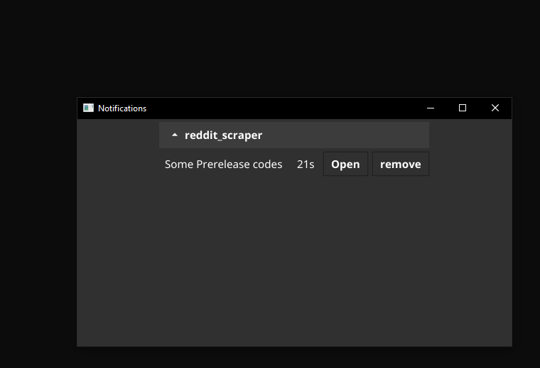

<!-- markdownlint-disable MD004 MD033 MD034 -->

<div align="center">
  
# Notification App
  

  
</div>
  
## Table of Contents

- [Introduction](#introduction)
- [Screenshots](#screenshots)

## Introduction
Lorem Ipsum

<div align="center">

[](https://github.com/enkemmc/notification_app/releases)

</div>

## Screenshots

<p align="center">
  
</p>

## Features

- Lorem Ipsum
  - Dolor
  - Sit
- Lorem Ipsum

## Install

``
go get -u github.com/enkemmc/notification_app
``

## Examples
```go
package main

import (
	"fmt"
	"math/rand"
	"time"

	"github.com/enkemmc/notification_app"
)

func main() {
	provider := GetProvider()
	app := notification_app.NewNotificationApp("123")
	app.AddTopic(provider)
	app.Start()
}

func GetProvider() notification_app.LinkProvider {
	myStruct := MyStruct{make(chan bool), make(chan []*notification_app.UrlData), "My Great App"}

	// start sending data through the channel to the ui
	go getDataAndSendToUiThroughChannel(myStruct.exitChannel, myStruct.urlsChannel)
	return myStruct
}

func getDataAndSendToUiThroughChannel(exitChannel chan bool, urlsChannel chan []*notification_app.UrlData) {
	ticker := time.NewTicker(5 * time.Second)
	for {
		select {
		case <-exitChannel:
			// you clicked the unsubscribe button in the ui, which stops this notification loop
			return
		case <-ticker.C:
			// generate two random data items to simulate timestamped events
			var di1, di2 notification_app.UrlData
			di1 = MyDataItem{fmt.Sprintf("http://www.%s.com", RandStringBytesMask(10)), time.Now()}
			di2 = MyDataItem{fmt.Sprintf("http://www.%s.com", RandStringBytesMask(10)), time.Now()}
			fabricatedData := []*notification_app.UrlData{&di1, &di2}
			for i, u := range fabricatedData {
				url := (*u).GetUrl()
				elapsed := (*u).GetElapsedTime()
				fmt.Println(i, " ", url, elapsed)
			}
			urlsChannel <- fabricatedData
		}
	}
}

type MyDataItem struct {
	url              string
	lastModifiedDate time.Time
}

func (this MyDataItem) GetElapsedTime() string {
	elapsed := time.Since(this.lastModifiedDate)
	return elapsed.Round(time.Second).String()
}
func (this MyDataItem) GetUrl() string {
	return this.url
}

type MyStruct struct {
	exitChannel chan bool
	urlsChannel chan []*notification_app.UrlData
	name        string
}

func (this MyStruct) GetExitChannel() chan bool {
	return this.exitChannel
}

func (this MyStruct) GetUrlsChannel() chan []*notification_app.UrlData {
	return this.urlsChannel
}

func (this MyStruct) GetName() string {
	return this.name
}

const letterBytes = "abcdefghijklmnopqrstuvwxyzABCDEFGHIJKLMNOPQRSTUVWXYZ"
const (
	letterIdxBits = 6                    // 6 bits to represent a letter index
	letterIdxMask = 1<<letterIdxBits - 1 // All 1-bits, as many as letterIdxBits
)

func RandStringBytesMask(n int) string {
	b := make([]byte, n)
	for i := 0; i < n; {
		if idx := int(rand.Int63() & letterIdxMask); idx < len(letterBytes) {
			b[i] = letterBytes[idx]
			i++
		}
	}
	return string(b)
}
```

